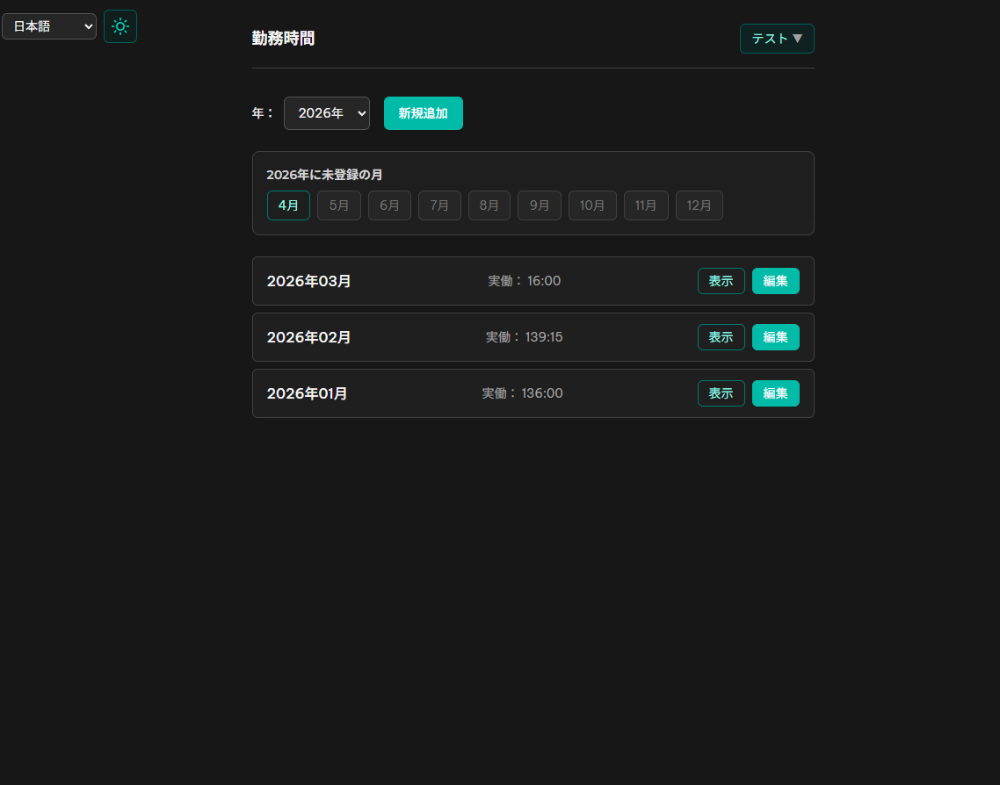
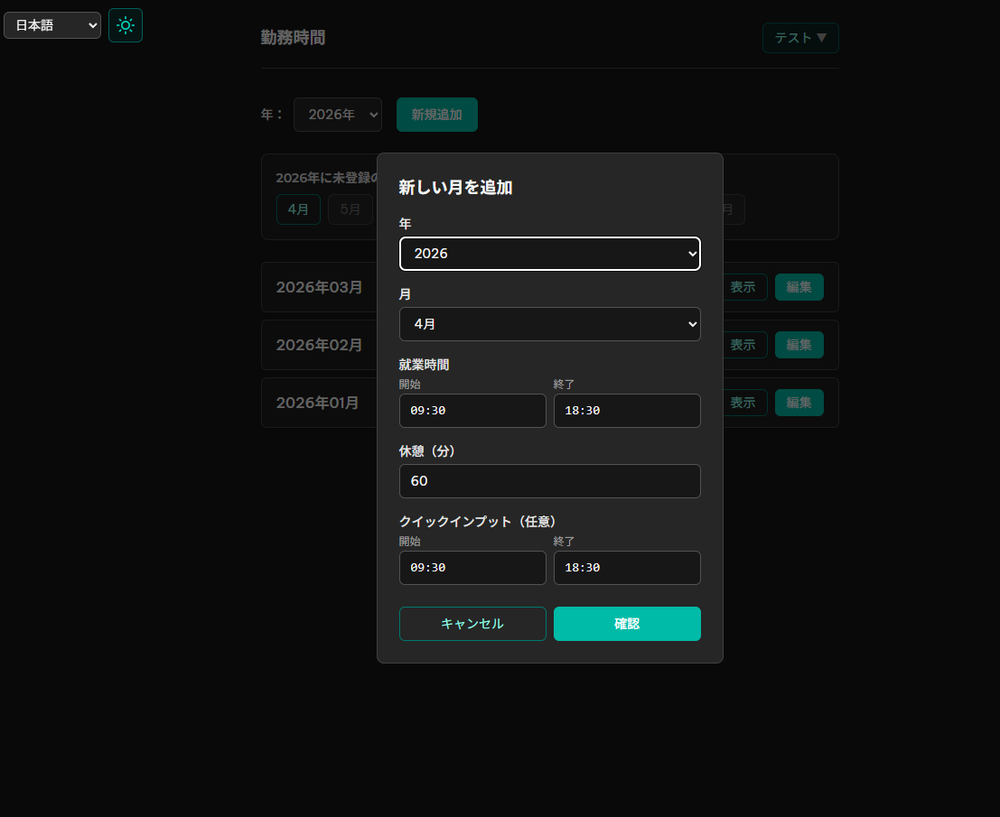
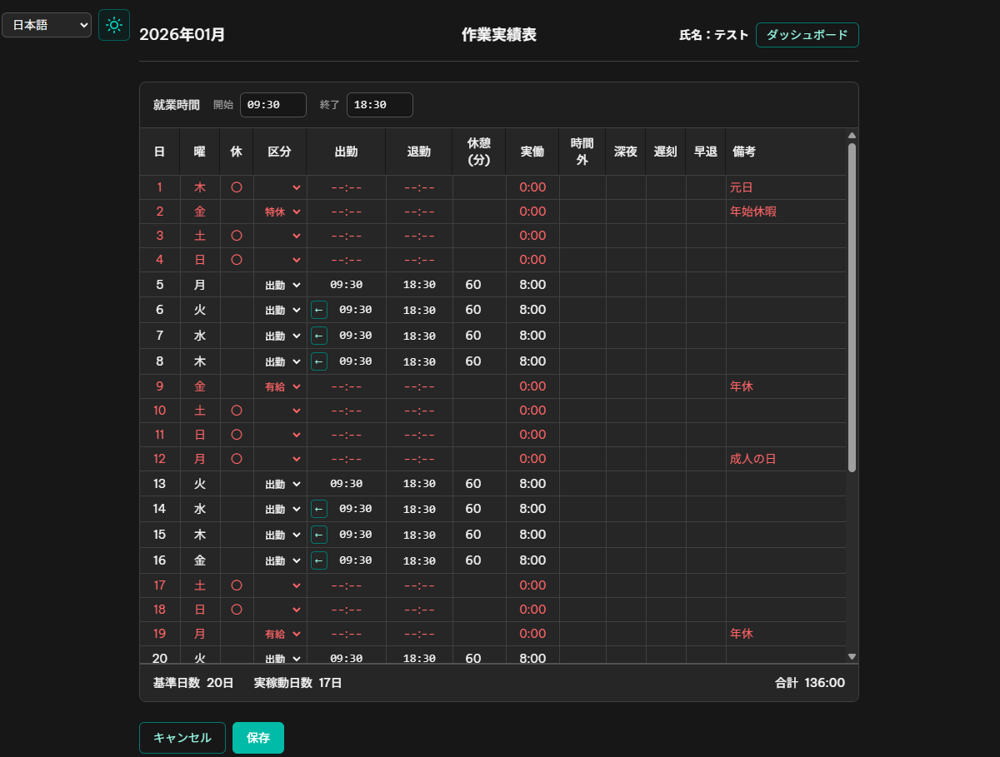

# 勤務時間 (Kinmu Jikan)

Ứng dụng web quản lý thời gian làm việc theo mô hình phổ biến tại Nhật Bản. Ghi chép và quản lý bản ghi theo tháng, tự động tính 実働 (thời gian thực), 時間外 (tăng ca), 深夜 (ca đêm), 遅刻 (đi muộn), 早退 (về sớm).

[日本語](./README.md) | **Tiếng Việt**

### Ảnh giao diện







## Giới thiệu

勤務時間 cung cấp các tính năng phù hợp với mẫu bảng chấm công thường dùng tại Nhật:

- **Ghi chép theo tháng**: Nhập giờ vào, giờ ra, thời gian nghỉ theo từng ngày
- **就業時間**: Thiết lập thời gian làm việc quy định (開始・終了), tự động tính 時間外・深夜・遅刻・早退
- **区分**: Chọn 出勤, 有給, 代休, 特休, 欠勤 (T7, CN, ngày lễ dùng category 休日, hiển thị trống)
- **Hiển thị ngày nghỉ**: Tự động đánh dấu thứ 7, chủ nhật, ngày lễ Nhật
- **Đa ngôn ngữ**: Tiếng Nhật, tiếng Việt
- **Dark mode**: Chuyển đổi giao diện sáng/tối
- **In**: PDF, export Excel, CSV

## Công nghệ

- **Frontend**: React 19 + Vite 7 + TailwindCSS 4 + TypeScript
- **API**: Node.js Serverless (Vercel)
- **Database**: Neon Postgres

## Yêu cầu

- Node.js 18+
- Tài khoản Vercel (deploy)
- Neon Postgres (qua Vercel Storage)

## Cấu trúc dự án

```
├── api/           # Serverless API (auth, work-records, cron)
├── lib/           # db, auth, rateLimit, turnstile
├── sql/           # schema.sql, migration
├── src/           # Ứng dụng React (TypeScript)
├── public/
├── pics/          # Ảnh cho README
├── scripts/
└── docs/
```

## Cài đặt local

```bash
npm install
cp .env.example .env
# Sửa .env: POSTGRES_URL (hoặc DATABASE_URL), JWT_SECRET
vercel dev
```

Mở http://localhost:3000. Frontend và API chạy cùng process.

**Lưu ý:** Chỉ dùng `npm run dev` khi chạy frontend thuần (không có API). Để có API local, dùng `vercel dev`.

## Deploy Vercel

1. Vercel Dashboard > Project > **Settings** > **General** > Root Directory: để trống hoặc `.`
2. Storage > Create Database > Postgres. Chạy `sql/schema.sql` trong Query tab. 
3. Environment Variables: `JWT_SECRET`, `POSTGRES_URL` (tự động khi thêm Postgres), `CRON_SECRET` (tối thiểu 16 ký tự, cho cron dọn rate_limit)
4. Push lên GitHub – Vercel tự deploy.

## Test local với DB production

1. Vercel Dashboard > Storage > Postgres > lấy connection string
2. Thêm vào `.env`: `POSTGRES_URL=...`, `JWT_SECRET=...` (cùng giá trị trên Vercel)
3. Chạy `vercel dev`
4. Mở http://localhost:3000

Xem `docs/TESTING.md` chi tiết.

## Lịch sử thay đổi

Xem [CHANGELOG.md](./CHANGELOG.md).
